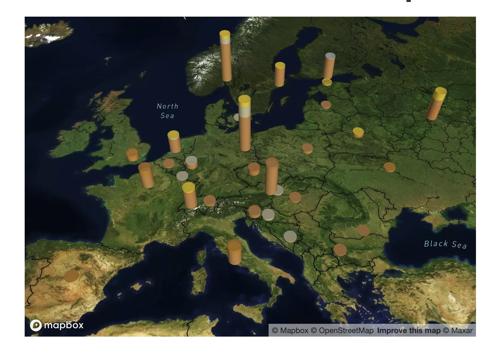

# Olympics_Forecasting_Dashboard
This application deploys a dashboard that uses financial modeling tools to forecast outcomes for the Olympic Games. It uses that data to project booksmakers odds charts for betting and compares it to popular betting websites odds.  The application charts the final medal counts for the 2022 Beijing Winter Olympics with an overlay of the application predictions.
<br><br>
This application is well suited for predicting not only Olympic games, but any sporting event that has historical data.

---
<br>

<br><br>

## Actual Medal Count with Predictions

<br><br>

## Historic Medal Count Map


---
## Technologies
This application requires:<br>

<br>
<br>
```
pip install streamlit
```
<br>
<br>
<br>

```
pip install jupyterlab
```

<br>
This application uses pystan
<br>

```
pip install pystan
```

<br>
This application uses Prophet
<br>

```
pip install prophet
```

<br>
This applications uses pandas<br>

<br>

```
pip install pandas
```

<br>
This application uses Pathlib<br>

```
pip install pathlib
```

<br>

<br>
This application uses pyviz and the associated hvplot and geoviews

```
conda install -c pyviz hvplot geoviews
```

<br>This application requires bokeh

```
pip install bokeh
```


---
## Contributors
Rachel Bates,
Daniel English,
Lari Rupp,
Enrique Viana

---

## License
Creative Commons


